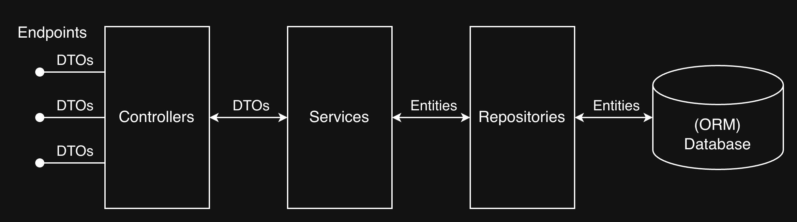

# C# .NET 10 Web API Example
A simple example of how a RESTful API could be built with .NET and EF Core incorporating clean architecture principles with a layered structure, with full CRUD endpoints.

## Tech Stack
- **Web API Framework:** .NET 10
- **ORM:** EF Core
- **Database:** SQLite
- **API Docs:** Swagger
- **Testing Framework:** xUnit

## Architecture
This project has a layered architecture for clear separation of concerns:

- **Controllers** - Handles HTTP requests and responses
- **Services** - Handles business logic and validation
- **Repositories** - Handles Data access
- **DTOs** - Data transfer objects for API contracts
- **Entities** - Database models (Customer, Order, OrderItem, Product)
- **Middleware** - Global exception handler
- **Extensions** - DTO<->Entity mapping and validation helpers



## ERC / Domain Model
In this example project I used a set of 4 entities: `Customer`, `Order`, `OrderItem`, `Product`.


## How To Run
1. Clone the repository
   ```bash
   git clone https://github.com/FrederikBertelsen/ef-core-api-example.git
   cd ef-core-api-example
   ```

2. Install dependencies
   ```bash
   dotnet restore
   ```

3. Run the application
   ```bash
   dotnet run -lp http
   ```
   
## Project Structure

```
ef-core-api-example/
├── Program.cs                 # Application entry point
├── src/
│   ├── Controllers/           # API controllers
│   ├── Data/
│   │   ├── AppDbContext.cs    # EF Core database context
│   │   └── Migrations/        # Database migrations
│   ├── DTOs/                  # Data transfer objects
│   ├── Entities/              # Database entity models
│   ├── Exceptions/            # Custom exception
│   ├── Extensions/            # Mapping & validation extensions
│   ├── Middleware/            # Global exception middleware
│   ├── Repositories/          # Data access
│   └── Services/              # Business logic
└── ef-core-api-example.Tests/
    └── Unit/
        └── Services/          # Unit tests for services
```

## Limitations

This project is a simple example of how you could write a RESTful web API and is not production-ready. Below are some of the weaknesses/shortcommings of this project.

#### **Security:**
The API has no authentication or authorization to protect endpoints and restrict access.

#### **Database:**
SQLite is used for simplicity. A production-ready version would probably use PostgreSQL.

#### **Logging & Monitoring:**
There is no logging or monitoring in place. This is nessesary to diagnose issues and track performance.

#### **Testing:**
There are only unit tests for the service layer. The project is missing integration and e2e tests.

#### **API Design**
This API is not fully features. There is for example no result pagination or caching, and it is missing a lot of endpoints to make it usable in a real world situation.

#### **Development Workflow**
The project was developed without feature branches or test-driven development, as I'm the only one who worked on this project.
